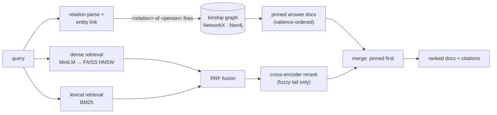

# genealogy-graphrag

A hybrid retrieval system for **provenance-grounded genealogical question answering**. It fuses dense (sentence-transformer) retrieval, sparse (BM25) retrieval, and **structured kinship-graph resolution**, then reranks with a cross-encoder. Every answer carries the bibliographic citations of the records it rests on.

The system is built to make one point measurable: **dense and lexical retrieval cannot answer relational questions** ("who was the maternal grandfather of X?"), because the answer entity is never named in the query — and a graph can. On the gold set, adding graph resolution takes **relational recall@5 from 0.000 to 1.000** and overall **MRR@10 from 0.77 to 1.00**, with no regression on the question types text retrieval already handles.

Everything here runs on CPU with no external services. The numbers below are produced by `eval/run_eval.py`, not asserted.

---

## Results

Corpus: 93 synthetic source documents · 37 gold questions · embeddings `all-MiniLM-L6-v2` (384-d) · ANN backend `faiss-hnsw`. Ablation adds one capability at a time.

| configuration | recall@1 | recall@3 | recall@5 | recall@10 | MRR@10 | nDCG@10 |
|---|---|---|---|---|---|---|
| vector-only | 0.676 | 0.797 | 0.811 | 0.820 | 0.782 | 0.786 |
| bm25-only | 0.635 | 0.730 | 0.770 | 0.811 | 0.722 | 0.740 |
| hybrid (vector+bm25) | 0.662 | 0.797 | 0.811 | 0.811 | 0.770 | 0.776 |
| hybrid + graph | 0.730 | 0.986 | 1.000 | 1.000 | 0.959 | 0.966 |
| **hybrid + graph + rerank** | **0.797** | **0.986** | **1.000** | **1.000** | **1.000** | **0.995** |

Recall@5 broken out by question category — where the lift actually comes from:

| configuration | lookup | provenance | household | **relational** |
|---|---|---|---|---|
| vector-only | 1.000 | 1.000 | 1.000 | **0.000** |
| bm25-only | 0.929 | 1.000 | 1.000 | **0.000** |
| hybrid (vector+bm25) | 1.000 | 1.000 | 1.000 | **0.000** |
| hybrid + graph | 1.000 | 1.000 | 1.000 | **1.000** |
| hybrid + graph + rerank | 1.000 | 1.000 | 1.000 | **1.000** |

### How to read this

- **Named-entity questions** (lookup / provenance / household) are already solved by text retrieval: the answer's documents share surface tokens and semantics with the query, so dense and BM25 both retrieve them at recall@5 = 1.000. Fusion and reranking mostly reorder within an already-correct candidate set.
- **Relational questions** are not. "Who was the maternal grandfather of Nancy Ainsworth?" never contains the string *Thomas Calloway*, so no lexical or dense scorer can surface his birth record — empirically **0.000** across all three text-only configurations. The only thing connecting *Nancy* to *Thomas's records* is the kinship edge set. A lightweight relation parser resolves `maternal grandfather of <anchor>` to the target person by graph traversal, and that person's identity records are injected as an authoritative result. Relational recall@5 goes 0.000 → 1.000; overall MRR@10 0.77 → 0.96.
- **Reranking** is applied only to the fuzzy (non-pinned) tail — a confident graph resolution is not subject to surface-relevance reordering. It buys top-rank precision: recall@1 0.730 → 0.797, MRR@10 → 1.000, by promoting a subject's own vital record above a census co-mention.
- **Honest caveat:** on this corpus hybrid ≈ vector-only, because the named-entity questions are easy for dense retrieval and BM25's marginal contribution (rare surnames, place names) is small at this scale. The headline lift is from the **graph**, not from sparse+dense fusion. BM25 earns its place on out-of-distribution proper nouns, not on these 37 questions.

---

## Architecture



| component | file | what it does |
|---|---|---|
| corpus generator | `data/generate_corpus.py` | deterministic 4-generation family → source documents, kinship graph, gold QA (answers derived by traversal, so they are provably correct) |
| dense index | `src/genealogy_rag/index/vector.py` | FAISS `IndexHNSWFlat` (inner product on normalised vectors); transparent numpy fallback |
| sparse index | `src/genealogy_rag/index/lexical.py` | BM25Okapi |
| embeddings | `src/genealogy_rag/embeddings.py` | `all-MiniLM-L6-v2`, L2-normalised, sha256 on-disk cache |
| graph backends | `src/genealogy_rag/graph/` | one `GraphStore` interface, two implementations: in-memory NetworkX (default) and Neo4j/Cypher (production) |
| relation resolver | `src/genealogy_rag/kinship.py` | parses `<relation> of <person>`, resolves the target via typed traversal; fires only on kinship questions |
| retriever | `src/genealogy_rag/retrieval.py` | RRF fusion + pinned graph resolution + tail rerank, each independently ablatable |
| reranker | `src/genealogy_rag/rerank.py` | `cross-encoder/ms-marco-MiniLM-L-6-v2`; degrades to a no-op if unavailable |
| eval | `eval/run_eval.py` | recall@k, MRR@10, nDCG@10, overall + per-category, writes `results.md` / `results.json` |

Fusion is **Reciprocal Rank Fusion** (`score(d) = Σ 1/(k + rank)`, k=60): scale-free, so it composes cosine, BM25, and graph-distance rankings without per-scorer weight tuning.

---

## Quickstart

```bash
python -m pip install -e ".[dev]"     # or: make setup
python data/generate_corpus.py        # make gen-data   (regenerate corpus + gold)
python eval/run_eval.py               # make eval       (full ablation, ~25s CPU)
python eval/run_eval.py --fast        # make eval-fast  (skip cross-encoder download)
pytest -q                             # make test
python scripts/demo.py "Who was the maternal grandfather of Nancy Ainsworth?"
```

`demo.py` output:

```
Q: Who was the maternal grandfather of Nancy Ainsworth?

Top supporting sources:
  [1] Birth record of Thomas Calloway (birth_record)
      Georgia, County Births, Greene County, vol. 5, p. 66.
  [2] Obituary of Thomas Calloway (obituary)
      The Atlanta Constitution, 1944-02-17, obituary of Thomas Calloway.
  [3] Biographical sketch of Thomas Calloway (biography)
      ...
```

---

## Production graph backend (Neo4j / Cypher)

The eval runs on the in-memory NetworkX store so it is reproducible with zero setup. The same `GraphStore` interface is implemented over Neo4j with parameterized Cypher, schema constraints, and indexes — switch by setting `NEO4J_URI`.

```bash
docker compose up -d neo4j                                   # or: make neo4j-up
NEO4J_URI=bolt://localhost:7687 python scripts/build_graph.py --load-neo4j
NEO4J_URI=bolt://localhost:7687 python eval/run_eval.py      # eval over the live DB
```

Schema and query-tuning notes live in `src/genealogy_rag/graph/schema.cypher` and `neo4j_store.py`: `:Person(id)` / `:Document(id)` uniqueness constraints back O(1) id seeks; neighbourhood traversal uses a hop-bounded `[:CHILD_OF|PARENT_OF|SPOUSE_OF*..n]` pattern; `MENTIONS` edges are pre-materialised so provenance lookups are single-hop.

---

## Weight attestation (Paramesphere S0)

This pipeline runs two open-weight models with full custody — the MiniLM embedder and the
ms-marco cross-encoder reranker. A tampered embedder corrupts every retrieval downstream
without raising an error, so `src/genealogy_rag/attest.py` fingerprints the *loaded* weights
and can verify them against a committed baseline:

```bash
python scripts/attest_weights.py --demo      # synthetic swap-test, no download (runs in CI)
python scripts/attest_weights.py             # attest the real embedder + reranker -> attestation/weights.json
```

```python
from genealogy_rag.embeddings import Embedder
att = Embedder().attest()        # -> Attestation(model, revision, fingerprint="wfp:…",
                                 #                 artifact_sha256="sha256:…", params, …)
```

The §10 S0 record binds three things in one attestation, computed **at model load**: the
pinned HF **revision** (set `EMBED_REVISION` / `RERANK_REVISION` to the commit SHA at build —
see `config.py`), the at-rest **`artifact_sha256`** of the local weight files (the cheaper,
stronger pin; `null` when the model was served straight from the network with nothing on disk
to hash — it degrades gracefully, never crashing the pipeline), and the **loaded-state
fingerprint**. The existing weekly drift-audit can regression-check the fingerprint for free.

Honest scope (the same truth-in-claims discipline as below): the loaded-state fingerprint is
a deterministic, content-addressed digest over tensor *values*. It earns its keep over a
plain file hash in exactly two cases — it catches tampering applied **after** load, and it is
**invariant to benign re-serialization** (re-saved/re-sharded weights keep the fingerprint
while `sha256(file)` changes). It is **not** the subspace `I(θ)` SVD of the Paramesphere
research line, and it is **not** quantization-robust (re-quantized weights trip it — a known
false positive). Same-model tamper/swap on a fixed weight set — not cross-model identity. Both
properties are pinned as executable assertions in `tests/test_attest.py`.

---

## Attested run manifest (weights → corpus → result)

A retrieval number is only as trustworthy as the chain behind it. `eval/run_eval.py` now
emits `eval/manifest.json` (`src/genealogy_rag/manifest.py`): a single content-addressed
record binding **which weights** ran (by their S0 `wfp:` fingerprint) over **which corpus**
(by content hash) under **which config** to produce **which results** (by digest). Change any
one — a swapped embedder, an edited document, a tweaked ablation, a different score — and the
`manifest_id` moves, so a published number can be re-derived and checked rather than taken on
faith. `verify_manifest()` confirms a manifest is internally consistent. Honest scope: it
claims nothing the inputs support — a manifest over an unloaded/unattested model carries a
`null` fingerprint and says so (the reranker is fingerprinted only when a rerank ablation
actually ran; we don't download a model just to hash it). Pinned in `tests/test_manifest.py`.

---

## Scribe OCR gate (S2 — self-hosting is earned, not assumed)

Scribe is the agent that turns a scanned record into structured facts. Self-hosting it is
justified **only by measured accuracy on a frozen eval corpus** — 17th-century secretary hand
is brutal for every model, so the corpus decides, not enthusiasm. `src/genealogy_rag/scribe.py`
is the model-agnostic decision machinery: CER / WER (Levenshtein) + structured-field accuracy,
and a gate that clears a backend for production only when all three clear their bar.

```bash
python eval/run_scribe_eval.py     # stub backends on the frozen corpus (runs in CI, no download)
```

A real OCR backend (a self-hosted VLM — TrOCR, Qwen-VL-class, olmOCR) plugs in behind the
`OcrBackend` protocol; its weights are fingerprinted by the S0 attest module above before it
is trusted, and running it is the Cloud Run GPU step gated on this harness clearing
`ScribeThresholds`. **Honest scope:** the bundled `data/scribe/corpus.jsonl` is *synthetic
placeholder* text whose field ground-truth is the reference extractor's own output — so it
exercises the gate (perfect stub passes, noisy stub is blocked with named reasons), it does
**not** measure a real model. The real corpus is built from `/proof` artifacts with verified
transcriptions — a human step. Claims pinned in `tests/test_scribe.py`.

---

## Scope and honest notes

- **Synthetic data, by design.** The family is generated deterministically (`SEED=17`), so the public repo carries no real-person PII and every gold answer is derivable from the tree rather than hand-asserted. To run over real data, replace the loader in `corpus.py` with a GEDCOM parser — the graph schema (persons, `CHILD_OF`/`SPOUSE_OF`, source `MENTIONS`) maps directly onto GEDCOM individuals, families, and source citations.
- **"Provenance" here means source citation** in the genealogical sense — a traceable bibliographic reference per claim — not a cryptographic proof-chain.
- **The graph stage is structured resolution, not subgraph-RAG.** It resolves a parsed relation to an entity and pins that entity's records. It does not yet do open-ended subgraph retrieval for multi-constraint questions ("descendants of X who lived in Georgia"); that is the natural next extension, along with an LLM answer-synthesis layer over the retrieved-and-cited context.
- **Eval scale.** 37 questions over 93 documents is enough to separate the configurations cleanly and keep the run deterministic and fast; it is not a claim about behaviour at corpus scale. The FAISS HNSW path and batched embedding cache are there so the same code scales without rewrite.

---

## Repository layout

```
genealogy-graphrag/
├── data/
│   ├── generate_corpus.py        # deterministic corpus + graph + gold generator
│   └── genealogy/                # documents.jsonl, graph.json  (committed for inspection)
├── src/genealogy_rag/
│   ├── corpus.py  config.py  embeddings.py  retrieval.py  rerank.py  provenance.py  pipeline.py  kinship.py
│   ├── attest.py  # weight-space attestation (Paramesphere S0)
│   ├── manifest.py # attested run manifest (weights → corpus → result)
│   ├── scribe.py  # OCR/extraction eval harness + the S2 production gate
│   ├── index/     # vector.py (FAISS), lexical.py (BM25)
│   └── graph/     # base.py, networkx_store.py, neo4j_store.py, schema.cypher
├── data/scribe/   # corpus.jsonl — frozen OCR eval corpus (synthetic placeholder)
├── eval/          # run_eval.py, run_scribe_eval.py, questions.jsonl, results.md
├── tests/         # pytest: corpus/graph integrity, resolver, retrieval, attest, scribe
├── scripts/       # build_graph.py, demo.py, attest_weights.py
├── docker-compose.yml   Makefile   pyproject.toml   requirements.txt
└── .github/workflows/ci.yml
```

MIT-licensed. CI runs lint, tests, and the fast ablation on every push.

---

## Context

Part of [**axiom-orion**](https://github.com/axiom-orion) — small, eval-driven engineering pieces that each turn one hand-waved claim into a reproducible number. The provenance-grounded retrieval and honest ablation shown here are the same principle the [**Vorion**](https://github.com/vorionsys) governed-AI platform (`@vorionsys/*`) applies to autonomous agents: every answer carries the evidence it rests on. Built by [Ryan Cason](https://github.com/vorionsys).

**Composed in production:** the relational-resolution capability proven here (`<relation> of <person>` → graph traversal, recall@5 0.000 → 1.000) is ported into [**cason-heritage**](https://github.com/axiom-orion/cason-heritage)'s "Keeper", which resolves kinship from the curated family graph instead of asking a model to guess it.
